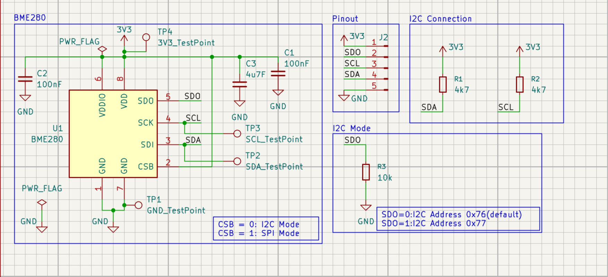
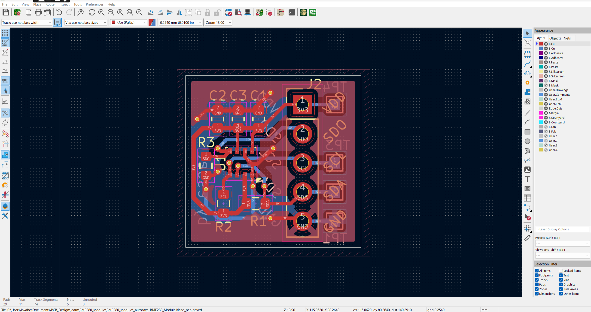
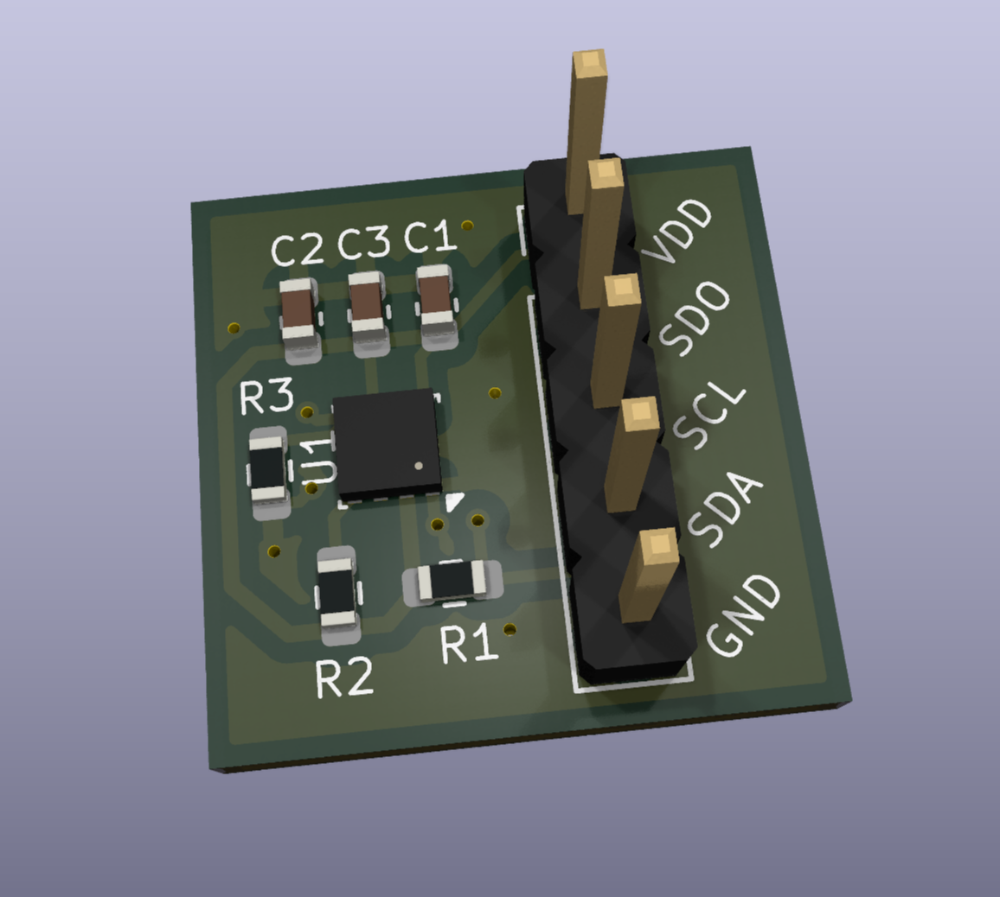
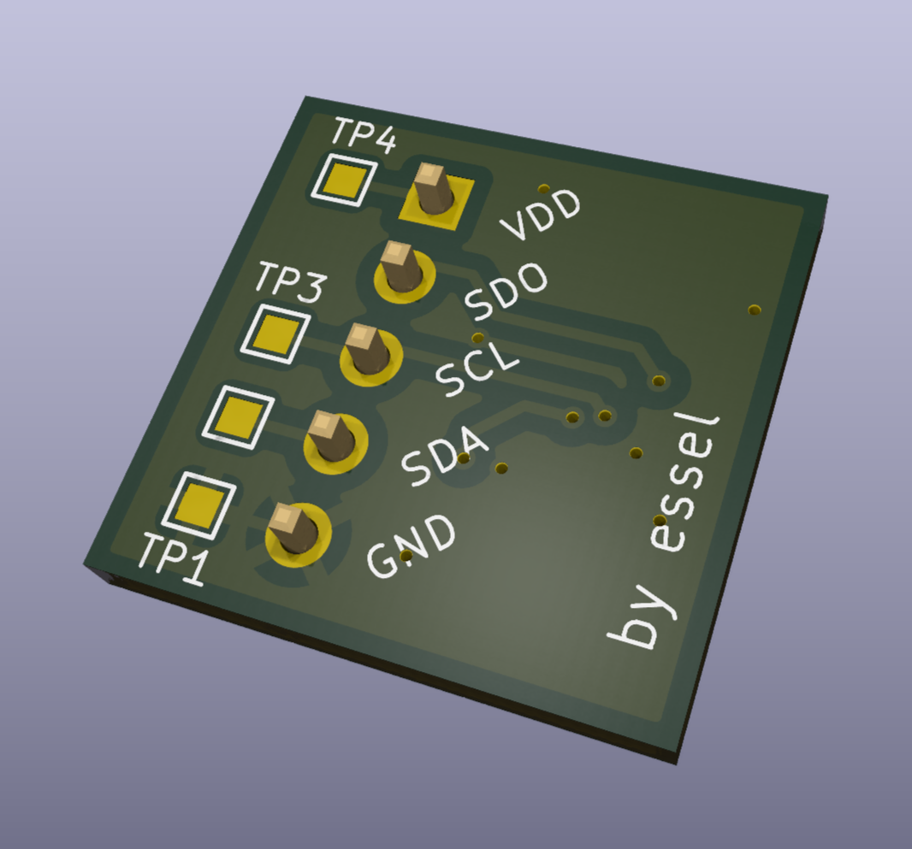

# BME280 Environmental Sensor Module (I²C)

A compact and reliable BME280 breakout module designed for accurate temperature, humidity, and pressure sensing using the I²C interface. This module is optimized for 3.3 V embedded systems and emphasizes proper power integrity, signal integrity, manufacturability, and validation readiness.

---

## Overview

This project is a custom-designed BME280 sensor module intended for use in embedded systems, robotics, and IoT applications. The goal was to design a clean, reusable hardware module while applying datasheet-driven design practices, proper decoupling, robust I²C communication standards, and design-for-manufacturing (DFM/DFA) considerations.

The module supports 3.3 V operation and is suitable for direct connection to microcontrollers such as Arduino, ESP32, STM32, and Raspberry Pi Pico.

---

## Features

- Measures **temperature, humidity, and atmospheric pressure**
- **I²C communication interface**
- **3.3 V operation**
- On-board **I²C pull-up resistors**
- Proper **decoupling and bulk capacitance**
- Default I²C address configured via **SDO pin**
- Test points for power and I²C lines
- Compact, reusable PCB footprint optimized for assembly

---

## Hardware Design

### Schematic

> 

### PCB Layout

> 

### 3D View 

>  > 

### Design Notes

- **VDD and VDDIO** are powered at 3.3 V to match microcontroller logic levels.
- **I²C pull-up resistors (4.7 kΩ)** are connected to 3.3 V to ensure reliable SDA/SCL signaling.
- **Decoupling capacitors (100 nF)** are placed close to the BME280 supply pins to suppress high-frequency noise.
- A **bulk capacitor** is included to stabilize the local power rail during transient current events.
- The **SDO pin is tied to GND** by default to select the lower I²C address.
- **Test points** are provided on critical nets (3.3 V, GND, SDA, SCL) to simplify probing, debugging, and validation.

---

## Electrical Specifications

| Parameter           | Value                   |
| ------------------- | ----------------------- |
| Supply Voltage      | 3.3 V                   |
| Interface           | I²C                     |
| Default I²C Address | 0x76 (SDO → GND)        |
| Pull-up Resistors   | 4.7 kΩ (SDA, SCL)       |
| Decoupling Caps     | 100 nF + bulk capacitor |

---

## I²C Address Configuration

The BME280 supports two I²C addresses:

- **SDO = 0 (GND)→ 0x76 (default)**
- **SDO = 1 (VDDIO) → 0x77**

In this design, the SDO pin is permanently tied to ground to ensure a consistent default address and simplify system integration.

---

## Signal Integrity Considerations

- Proper pull-up resistor sizing ensures clean SDA/SCL rise times and prevents bus instability.
- Short trace lengths and direct routing were used for I²C lines to minimize capacitance and noise pickup.
- Adequate ground referencing and decoupling placement were used, to improve signal reliability and filter power rail noise.

---
## Test & Validation

- Powered using a regulated **3.3 V supply**
- Successfully detected on the I²C bus
- Sensor readings verified through microcontroller-based testing
- Stable communication observed with no bus errors

---

## Lessons Learned

- Importance of reading **power-domain requirements** carefully in sensor datasheets
- Proper **pull-up resistor sizing** is critical for reliable I²C communication
- Decoupling placement has a significant impact on signal stability
- Small hardware modules benefit greatly from early validation and address planning

---

## Files Included

- Schematic
- PCB layout
- Gerber files
- Bill of Materials (BOM)
- BME280 datasheet

---

## Future Improvements (v2 Ideas)

- Optional jumper for I²C address selection
- Mounting holes for mechanical integration
- SPI interface option
